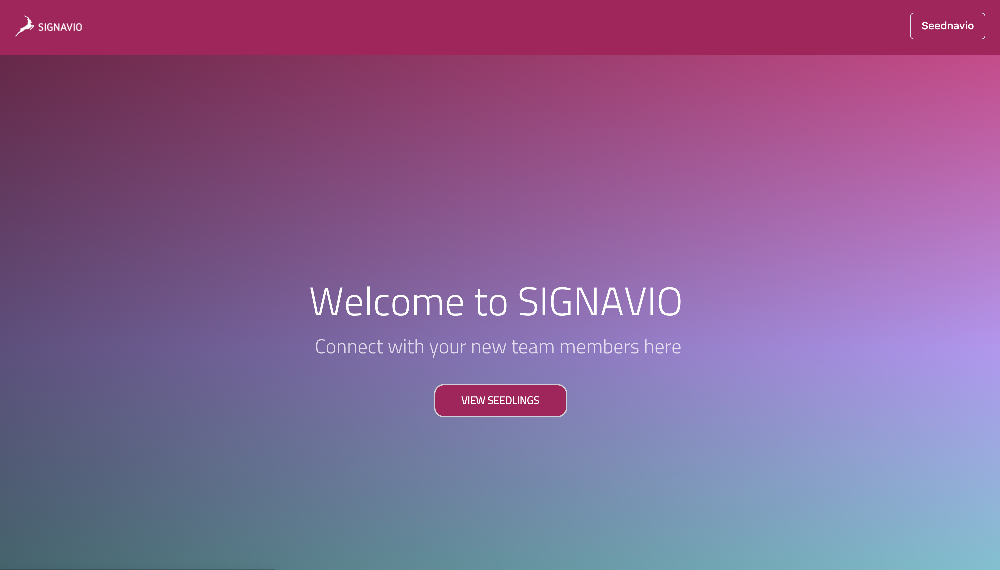
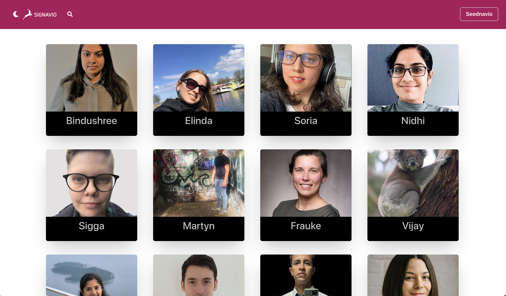
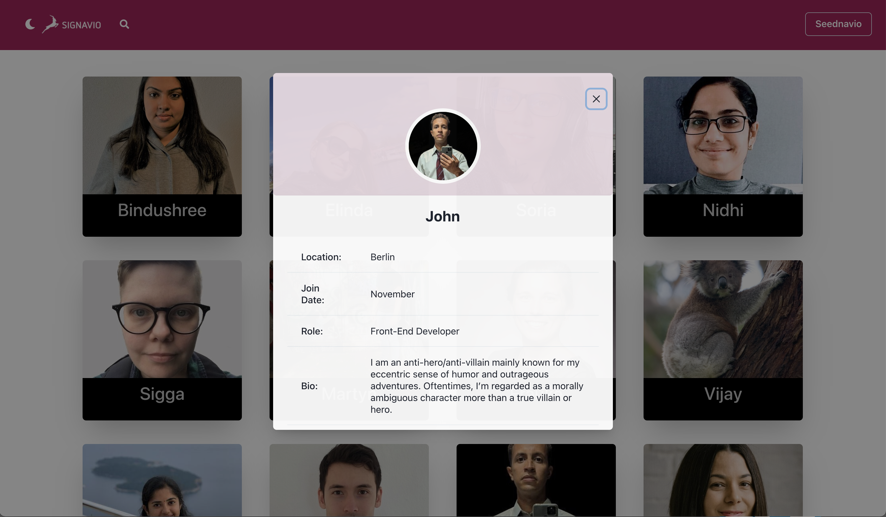
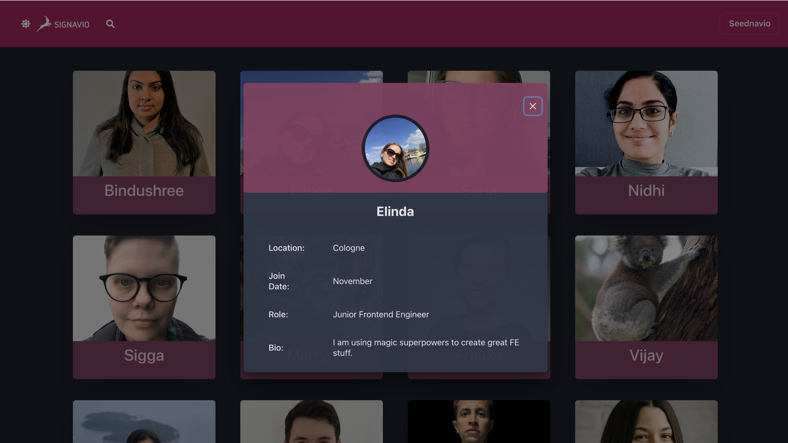
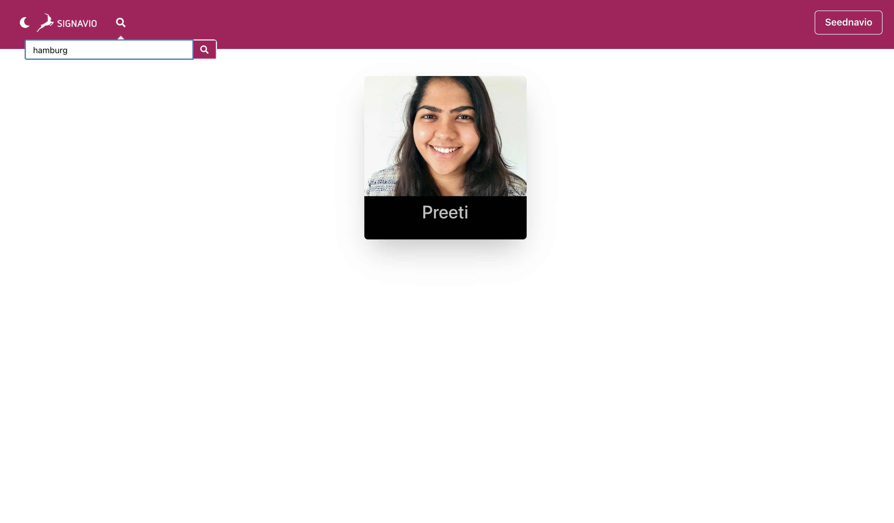
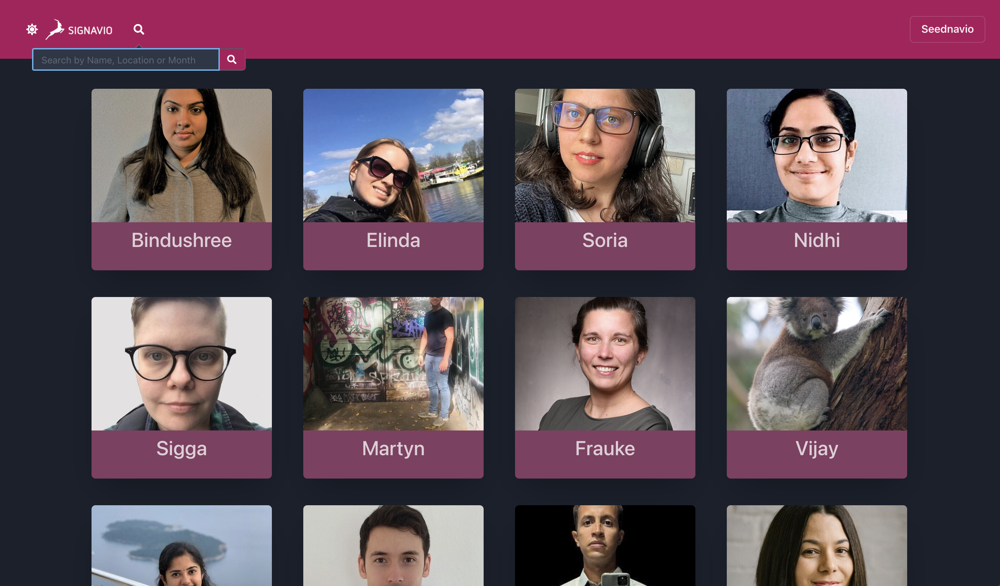
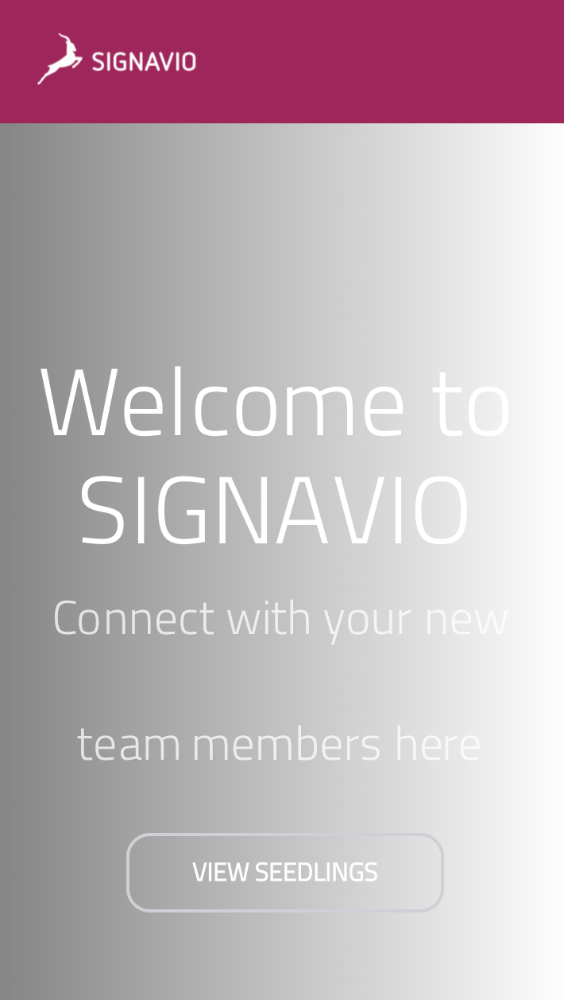

# Table of contents
* [General info](#seedlify-app)
* [Technologies](#technologies-used)
* [Stucture](#structure)
* [Setup](#setup)
* [Contribution](#contribution)

# Seedlify App

This project is a fullstack single-page React App.

### Overview


This application is a platform where new hires can introduce themselves and connect with their fellow teammates.

### What can a user do ?

* view all new starters
* view individual profile page
* search by name, month or location

# Technologies used

* React.JS
* Jest
* Chakra UI
* React router
* Axios

# Structure
```
SIGNAVLINGS
│   README.md
│   .gitignore     
|   package-json
|   package-lock.json
|
└───public
│   │   images
│   │   index.html
|   |   manifest.json
|   |   robots.txt  
│   
└───src
|   │   components
|   |   routing
|   |   utils
|   |   App.css
|   |   App.js
|   |   App.test.js
|   |   index.css
|   |   index.js
|   |   ProfileCard.test.jsx
|
└───test
```

# Technical Description

1. We used the endpoint calling a get request using axios library.


2. It sends back a JSON file with all the profiles as an array with all properties.


3. Using Chakra modal, we were able to create a popup triggered when clicked on one of the list's card.



4. We can filter the list based on a search by name, city or month.



5. Responsive layout on mobile phone.



# Setup

To run this project, install npm:
### `npm i`

In the project directory, you can run:
### `npm start`

Runs the app in the development mode.\
Open [http://localhost:3000](http://localhost:3000) to view it in the browser.

### `npm test`
We were unit testing using Jest and React Testing library.

## Contribution

**Front-end team:**
* Zuzanna Tarka: [@tarkazuz](https://github.com/tarkazuz)
* John Rosario: [@knottykid](https://github.com/knottykid)
* Cintia Garcia: [@cintiagarcia](https://github.com/cintiagarcia)
* Mintra Domundee: [@mintradmd](https://github.com/mintradmd)
* Cécile Eboa: [@yabacici](https://github.com/yabacici)


